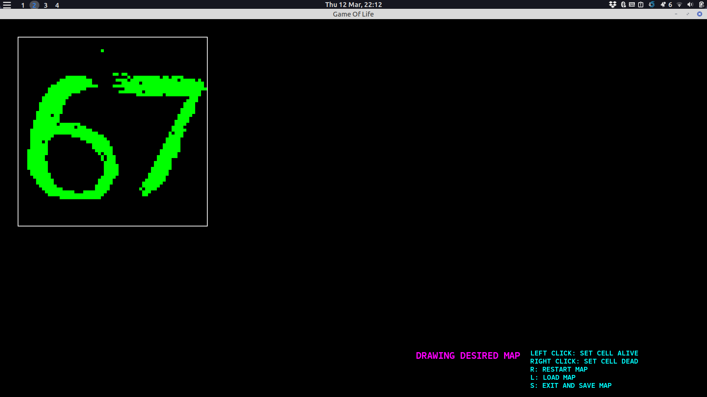
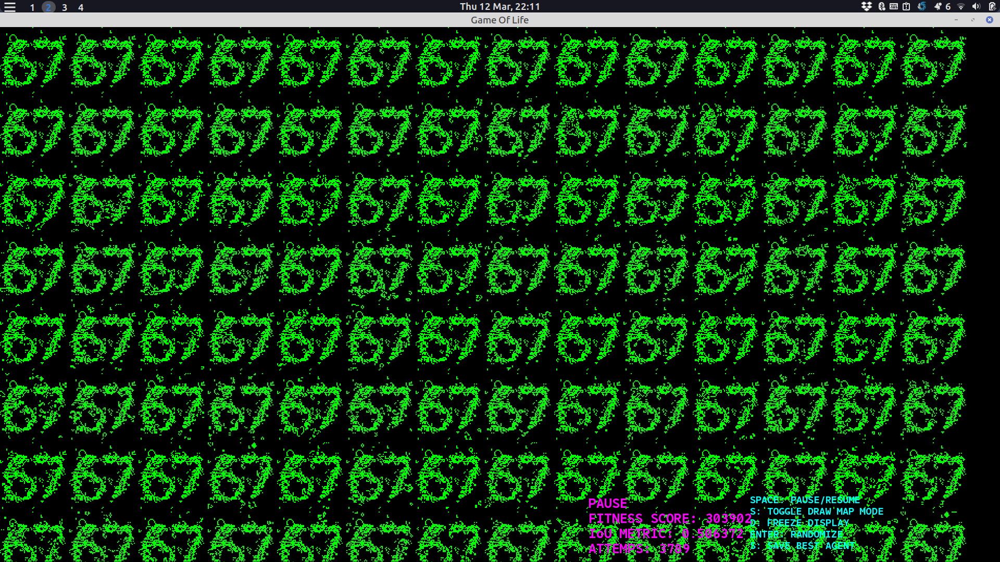

# Reverse Game of Life (Genetic Algorithm & Bitboards)

This is the Reverse Game of Life project using a Genetic Algorithm with a Bitboard data structure. 
This project is only for my educational purpose in order to practice coding, integrating ML concepts, and optimizing algorithms in C++.

## Overview about Game of Life
Conway's Game of Life is a cellular automaton played on a 2D grid of cells. Each cell has two possible states: Alive (1) or Dead (0). The grid evolves step-by-step based on four simple rules:
1.  **Underpopulation:** An alive cell with fewer than 2 alive neighbors dies.
2.  **Survival:** An alive cell with 2 or 3 alive neighbors stays alive.
3.  **Overpopulation:** An alive cell with more than 3 alive neighbors dies.
4.  **Reproduction:** A dead cell with exactly 3 alive neighbors becomes alive.

The "Reverse" Game of Life (also known as the Inverse Game of Life) is the challenge of starting with a desired final image, and trying to find the Generation 0 "seed" that will evolve into that exact image after a certain number of steps.

## Bitboard
For general GOL implementation, we usually use a 2D array as the grid. However, in this project, I attempt to try a Bitboard (which has commonly been used for Chess engines) to represent the 2D board.

Instead of a 2-dimensional array, we pivot to use a 64-bit integer (`uint64_t`) for a single row, and stack 64 of them to create a 64x64 grid. Because each cell only needs two states—0 (Dead) and 1 (Alive)—it perfectly fits the requirement.

About the operations:
* **Getting/Setting Cells:** We use bitwise shifts (`1ULL << x`) combined with bitwise OR (`|`) to set a cell alive, and bitwise AND with NOT (`& ~`) to kill a cell.
* **Physics Engine Optimization:** Because the rows are raw integers, we can calculate the Game of Life rules for an entire row of 64 cells simultaneously using bitwise logic (Half Adders and Full Adders) instead of looping through individual cells. This makes the simulation blazingly fast.

## Genetic Algorithm
Because the Game of Life is highly chaotic, I implemented a Genetic Algorithm to try and "evolve" a random starting seed into a target drawing over several generations.

* **Population:** The environment consists of 100 "Agents". Each agent holds a genotype (the initial Gen 0 seed) and a phenotype (the active physics grid). At the start, the population is initialized with sparse random noise using bitwise ANDs to prevent immediate mass extinction.
* **Fitness Score:** The algorithm grades how close an agent's final grid is to the desired map. It calculates this by isolating True Positives (correctly alive cells) and True Negatives (correctly dead cells) using bitwise logic, rewarding the agent heavily for matching the drawn shape.
* **Selection:** I use Tournament Selection. Instead of pure Roulette Wheel math, the algorithm randomly picks 4 agents and makes them "fight." The one with the highest fitness score gets to breed. I also use Elitism to protect the top 20 best-performing grids from being mutated.
* **Crossover:** To breed two winning agents, a random 2D bounding box is generated. The bits inside the box are sliced from Parent B and inserted into the exact same location in Parent A using bitmasks, creating a child with mixed DNA.
* **Mutation:** To maintain genetic diversity and prevent the population from getting stuck, each child has a 5% chance of undergoing mutation. If triggered, a random bit in the seed is flipped (XOR) to explore new patterns.

## Technologies Used
* C++17
* SFML
* CMake

## Running the Code 
```
git clone 
cd build 
cmake .. && make && ./gameoflife

```

## Key binds
In the simulation page:
* **Space**: Pause/Resume the simulation
* **D**: Freeze the display (the physics engine will still run, but the screen won't update)
* **Enter**: Randomize the population with new seeds
* **S**: Toggle into drawing mode
* **Y**: Save the current best seed
In the drawing mode:
* **Left Click**: Draw alive cells
* **Right Click**: Erase cells (make them dead)
* **R**: Clear the drawing
* **S**: Exit and save the drawing
* **L**: Load the last saved drawing

## Actually Results
To be honest, the results are not very good, metrics are kinda low. The output can only get a very rough, still recognizable shape, but it is still far from the target. The lower the max generation, the better the result.





those outputs are sorted by their fitness score, the top one is best result.
